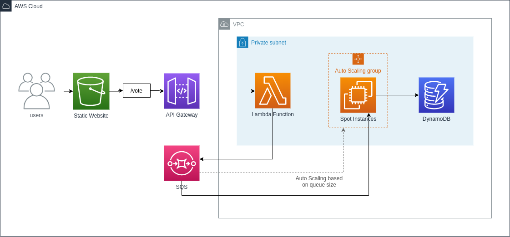

# Decoupled SQS Application

This is an example of architecture that I have been wanting to try out a long time ago. 
It follows some of the AWS architecture principles to decouple the frontend request and 
the backend processing, using SQS queues for that.



## How to use
On Linux, run in your terminal:
```bash
# You need to configure your AWS credentials before running

# The CloudFormation was created in us-east-2, some of the CloudFormation might need to be changed to create it in another region
export AWS_DEFAULT_REGION="us-east-2" 
chmod +x ./deploy-stack.sh
./deploy-stack.sh
```

## More documentation coming soon