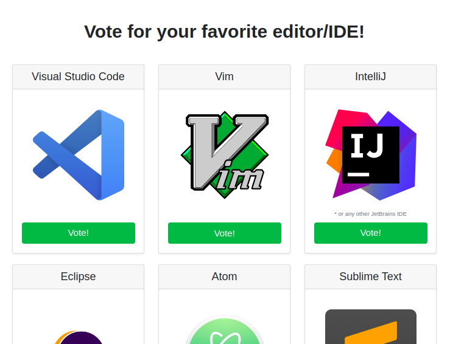
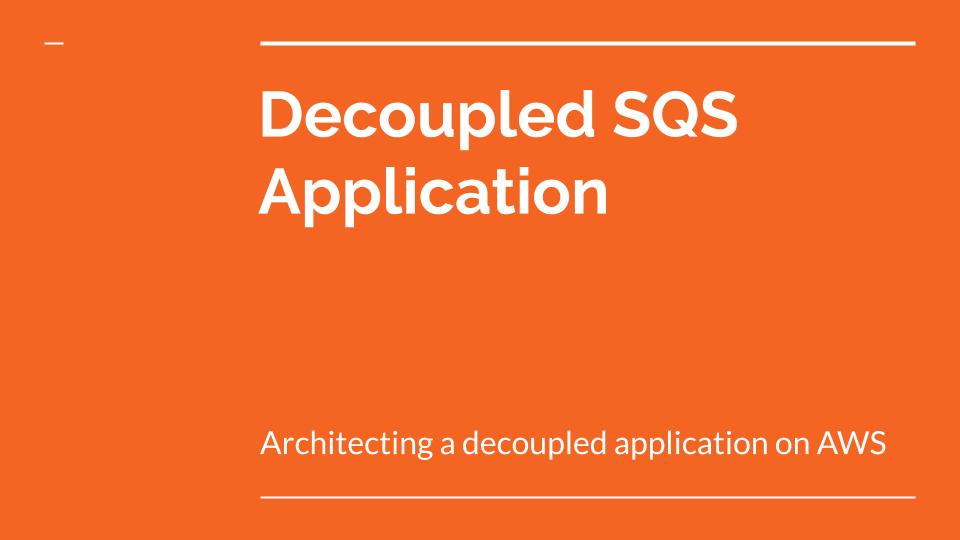

# Decoupled SQS Application

This is an example of architecture that I have been wanting to try out a long time ago. 
It follows some of the AWS good architecture principles to decouple the frontend requests and 
the backend processing, using SQS queues for that.


The goal of this project was to create an application where users could vote for their favorite text editor 
or programming IDE. The entire infrastructure was written as code, using CloudFormation.
This project was created as part of the **ProjectGallery Challenge** from 
**Bertelsmann Udacity Cloud Scholarship**. Below is an example of the application look:



In this example the benefits of this architecture may not be very clear, but if your back-end 
does some slow processing like fraud checking before finishing an online order, it’s a good 
practice to decouple it from the front-end to give your users a quick response. Another benefit
is that you can have a very small (or even zero) processing machines running, and scale them as
the SQS queue grows.

## Subprojects

This repository contains only the CloudFormation code, but there are some other repos that contribute to the project as a whole.

- [CloudFormation code (this repo) | YAML](https://github.com/GusAntoniassi/decoupled-sqs-application)
- [API Lambda code | Python](https://github.com/GusAntoniassi/decoupled-sqs-application-voting-api-lambda)
- [Static website code | HTML + JS](https://github.com/GusAntoniassi/decoupled-sqs-application-static-website)
- [Processing code for the EC2 instances | Python](https://github.com/GusAntoniassi/decoupled-sqs-application-processing-code)

## How to deploy

I created a [`deploy-stack.sh`](deploy-stack.sh) script to automate the deployment of this stack. 
It does things like creating an S3 bucket to store the CloudFormation scripts, which is necessary
since this stack uses [nested stack](https://docs.aws.amazon.com/AWSCloudFormation/latest/UserGuide/using-cfn-nested-stacks.html) scripts.
The script also clones the Lambda and website code from git, and uploads them to their respective buckets.
A shell script was necessary because those features aren't natively available from CloudFormation.

### Running with Docker (recommended)
To deploy the stack in your account, you could try running one of these steps in your terminal:

#### Binding your credentials file (recommended)

Replace `~/.aws/credentials` with the path for your credentials file, eg. `C:\Users\GusAntoniassi\.aws\credentials`

```
docker pull gusantoniassi/decoupled-sqs-application:latest

docker run -it --rm \
    -v ~/.aws/credentials:/root/.aws/credentials \
    -e AWS_DEFAULT_REGION=us-east-1 \
    gusantoniassi/decoupled-sqs-application:latest

# You can pass other AWS CLI variables to the command too, like:
# -e AWS_PROFILE=foobar
```

#### Passing your credentials to the command (not recommended)

Not recommended for security reasons, since your secret access key would be in your shell command history.

```
docker pull gusantoniassi/decoupled-sqs-application:latest

docker run -it --rm \
    -e AWS_ACCESS_KEY_ID=AKIA123456890 \
    -e AWS_SECRET_ACCESS_KEY=1234567890 \
    -e AWS_DEFAULT_REGION=us-east-1 \
    gusantoniassi/decoupled-sqs-application:latest
```

### Running with Linux

Requires the following software installed: `jq`, `zip`, `git` and `bash`. Run in your terminal:

```bash
# You need to configure your AWS credentials before running

export AWS_DEFAULT_REGION="us-east-1"
chmod +x ./deploy-stack.sh
./deploy-stack.sh
```

## Presentation Slides

I have created a presentation for this project. Click the image below to access it:

[](docs/Decoupled_SQS_Application.pdf)

## Points of improvement

Due to the time constraints, I couldn't bring this project to the level I wanted. 
Here are some points where I could improve it (those marked with an ✔️ have already been done):

- **Smarter queue scaling:** Currently the Spot fleet will scale up if there are 
10 messages in the queue, and scale down if there are 0. But doing it this way 
we can’t have 0 instances running if the queue is empty. My idea is to create 
custom CloudWatch metrics with the number of instances and the messages in queue, 
to allow for better calculations and scaling alarms.

- **Improve documentation:** Add a README.md for all the sub-repositories, and
document the shell script to be more clear. Maybe it would be good to ask for user
input too, like the AWS region you want to deploy it.

- ✔️ **Allow every region:** Currently because the AMI ID I've used is in Ohio, the 
stack can only be deployed there, unless you change the CloudFormation code. I could
create a `Mapping` with the AMI ID for every AWS region there is, and pick it dynamically
based on the `AWS::Region` CloudFormation variable.

- ✔️ **Create a Docker deploy image:** I think the deploy script will only work on Linux 
(and maybe Mac). A good way to solve this would be to use a Docker image to wrap the deployment script.

---

Feedback on this project would be greatly appreciated!